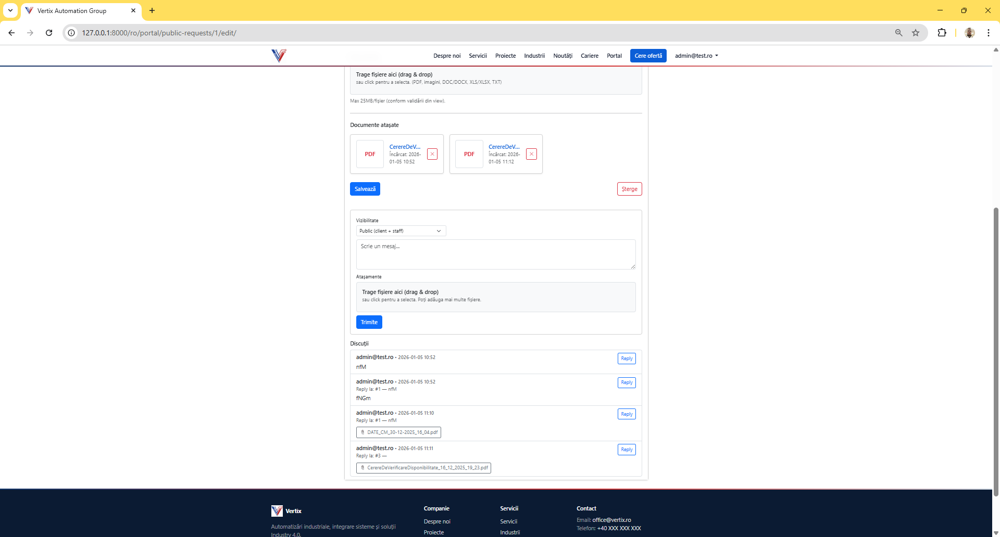

# Vertix Automation Group 🚀

**Vertix Automation Group** este o platformă web profesională dezvoltată în **Django**, destinată companiilor din zona industrială, care combină:
- website corporate modern
- prezentare servicii și industrii
- portal intern pentru cereri de ofertă
- sistem de administrare custom (Django Admin + portal intern)
- conținut editorial (Blog & Noutăți)
- pagini legale și configurare dinamică a site-ului

---

## 📌 Status proiect

- 🟢 Activ
- 🔒 Proiect privat
- 🏗️ În dezvoltare continuă

---

## 🌐 Prezentare generală

Platforma Vertix este gândită ca un **ecosistem digital end-to-end** pentru zona industrială, acoperind:
- vânzare echipamente
- service & mentenanță
- retrofit industrial
- automatizare industrială
- RPA (Robotic Process Automation)

Aplicația deservește:
- **clienți externi** (website + cereri ofertă)
- **echipa internă** (portal, administrare, analiză)

---

## 🖼️ Capturi de ecran (aplicația reală)

> Toate imaginile sunt salvate în `docs/images/`

### 🏠 Acasă (Homepage)


### 🛠️ Servicii


### 🏭 Industrii


### ℹ️ Despre noi


### 🧑‍💼 Portal – Cereri & management


### 📩 Contact / Cerere ofertă


### 💼 Cariere


### 📰 Blog & Noutăți


### ⚙️ Setări site (portal intern)


### 🛠️ Admin Dashboard (Django Admin custom)


### 💬 Mesaje & notificări (Pop-up site)


---

## 🧱 Arhitectură aplicație

Platforma este construită pe o arhitectură **Django modulară**:

Vertix/
├── accounts/ # autentificare, roluri, utilizatori
├── portal/ # cereri ofertă, statusuri, setări site
├── website/ # pagini publice (home, servicii, blog)
├── templates/ # template-uri HTML
├── static/ # CSS, JS, imagini
├── locale/ # traduceri (RO / EN)
├── docs/
│ └── images/ # screenshot-uri README
├── manage.py
└── requirements.txt


---

## ⚙️ Tehnologii utilizate

### Backend
- Python 3.x
- Django 5.x
- Django Admin (custom UI)
- Django i18n
- Django Forms + CSRF

### Frontend
- HTML5
- CSS3
- Bootstrap 5
- JavaScript (Vanilla)

### Bază de date
- SQLite (development)
- PostgreSQL (production – recomandat)

---

## 🔐 Autentificare & roluri

### Roluri disponibile
- **ADMIN** – control complet
- **MANAGER** – gestionare cereri și conținut
- **CLIENT** – cereri ofertă și portal

### Securitate
- CSRF protection
- validări formulare
- acces diferențiat pe roluri
- protecție anti-bot

---

## 🧩 Module principale

### Website public
- Acasă
- Despre noi
- Servicii
- Industrii
- Blog & Noutăți
- Contact
- Cariere
- GDPR / Cookies


---

### Servicii industriale
- Vânzare echipamente
- Service & mentenanță
- Retrofit industrial
- Automatizări PLC / HMI / SCADA
- Automatizare procese (RPA)
- IT industrial & integrare sisteme

---

### Portal intern
- Cereri ofertă (publice / interne)
- Statusuri personalizate
- Alocare tehnicieni
- Filtrare avansată
- Export date
- Setări site (activare/dezactivare pagini)

---

### Admin Dashboard
- Gestionare conținut site
- Blog & industrii
- Mesaje pop-up & notificări
- Utilizatori & grupuri
- Analytics (page views)

---
---

### 💬 Mesaje & notificări (Pop-up site)

Platforma include un sistem de **mesaje pop-up configurabile din Admin**, utilizat pentru informarea rapidă a utilizatorilor.

#### Tipuri de mesaje suportate:
- Mesaje informative (ex: program special, mentenanță)
- Alerte importante (ex: indisponibilitate servicii)
- Mesaje temporare (campanii, anunțuri)

#### Funcționalități:
- activare / dezactivare mesaj
- perioadă de afișare (start / end)
- afișare pe pagini publice
- control din Django Admin
- suport pentru mai multe mesaje active

#### Exemple de utilizare:
- „Program de sărbători – activitate suspendată”
- „Mentenanță programată”
- „Activitate limitată – suport de urgență”

Mesajele sunt afișate automat utilizatorilor și pot fi administrate fără modificări de cod.

## 🌍 Multilingv

- 🇷🇴 Română
- 🇬🇧 Engleză

Implementare:
- ``
- `gettext`
- `locale/`

---

## 🚀 Instalare locală

```bash
git clone <repo>
cd Vertix

python -m venv venv
source venv/bin/activate  # Windows: venv\Scripts\activate

pip install -r requirements.txt
python manage.py migrate
python manage.py createsuperuser
python manage.py runserver
Acces:

Website: http://127.0.0.1:8000/

Admin: http://127.0.0.1:8000/admin/

⚠️ Recomandări producție

DEBUG = False

PostgreSQL

Gunicorn + Nginx

HTTPS (Let’s Encrypt)

Backup automat DB

Loguri aplicație

📈 Extensii viitoare

API REST (Django REST Framework)

Integrare ERP / CRM

Dashboard analytics avansat

Notificări email & status

Automatizare fluxuri interne

📜 Licență

© 2025 Vertix Automation Group
Toate drepturile rezervate.
Utilizare internă sau contractuală.

📞 Contact

