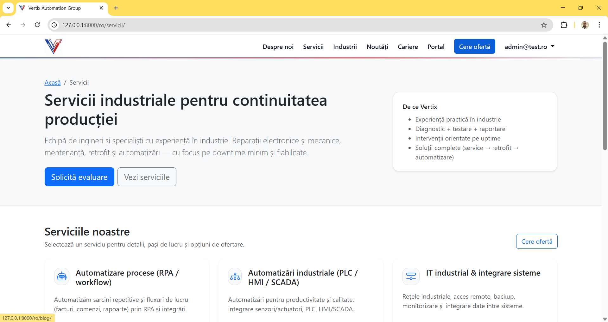
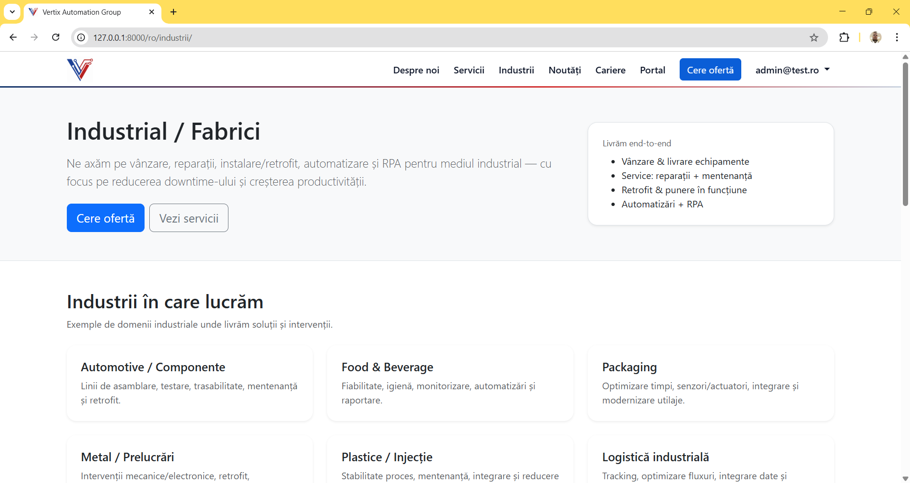
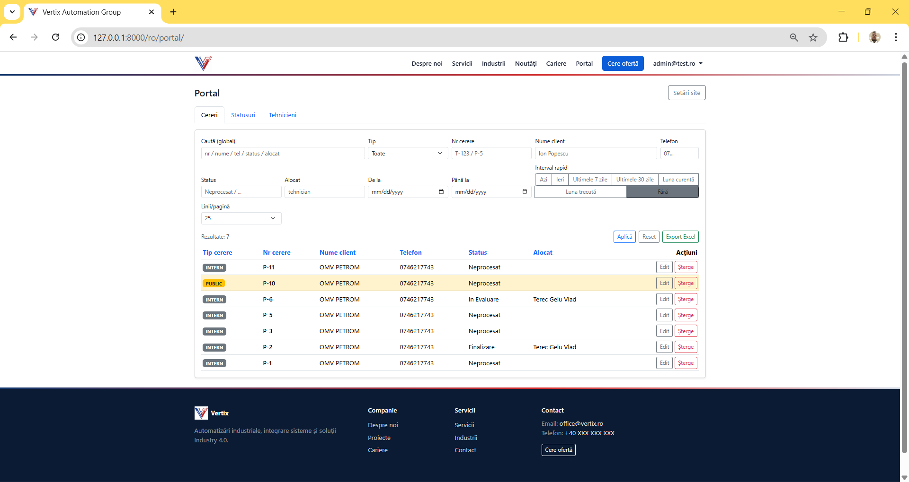
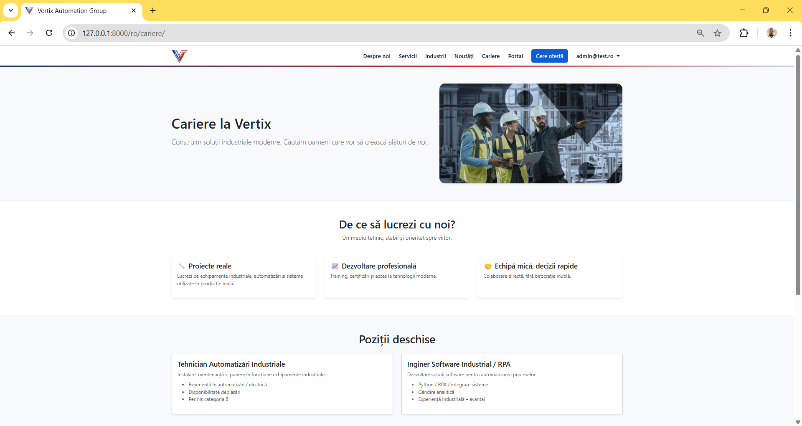

# Vertix Automation Group 🚀

**Vertix Automation Group** este o platformă web profesională dezvoltată în **Django**, destinată companiilor din zona industrială, care combină:
- website corporate modern
- prezentare servicii și industrii
- portal intern pentru cereri de ofertă
- sistem de administrare custom (Django Admin + portal intern)
- conținut editorial (Blog & Noutăți)
- pagini legale și configurare dinamică a site-ului

---

## 📌 Status proiect

- 🟢 Activ
- 🔒 Proiect privat
- 🏗️ În dezvoltare continuă

---

## 🌐 Prezentare generală

Platforma Vertix este gândită ca un **ecosistem digital end-to-end** pentru zona industrială, acoperind vânzare, service, retrofit, automatizare industrială și RPA.

Aplicația deservește atât:
- clienți externi (website + cereri)
- cât și echipa internă (portal, administrare, analiză)

---

## 🖼️ Capturi de ecran (aplicația reală)

> Toate imaginile sunt salvate în `docs/images/`

### 🏠 Acasă (Homepage)


### 🛠️ Servicii


### 🏭 Industrii


### ℹ️ Despre noi


### 🧑‍💼 Portal – Cereri & management


### 📩 Contact / Cerere ofertă


### 💼 Cariere


### 📰 Blog & Noutăți


### ⚙️ Setări site (portal intern)


### 🛠️ Admin Dashboard (Django Admin custom)


---

## 🧱 Arhitectură aplicație

Platforma este construită pe o arhitectură Django modulară:

Vertix/
├── accounts/ # autentificare, roluri, utilizatori
├── portal/ # cereri ofertă, statusuri, setări site
├── website/ # pagini publice (home, servicii, blog)
├── templates/ # template-uri HTML
├── static/ # CSS, JS, imagini
├── locale/ # traduceri (RO / EN)
├── docs/
│ └── images/ # screenshot-uri README
├── manage.py
└── requirements.txt


---

## ⚙️ Tehnologii utilizate

### Backend
- Python 3.x
- Django 5.x
- Django Admin (custom UI)
- Django i18n
- Django Forms + CSRF

### Frontend
- HTML5
- CSS3
- Bootstrap 5
- JavaScript (Vanilla)

### Bază de date
- SQLite (development)
- PostgreSQL (production – recomandat)

---

## 🔐 Autentificare & roluri

### Roluri disponibile
- **ADMIN** – control complet
- **MANAGER** – gestionare cereri, conținut
- **CLIENT** – cereri ofertă, portal

### Securitate
- CSRF protection
- validări formulare
- acces diferențiat pe roluri
- protecție anti-bot

---

## 🧩 Module principale

### Website public
- Acasă
- Despre noi
- Servicii
- Industrii
- Blog & Noutăți
- Contact
- Cariere
- GDPR / Cookies

---

### Servicii industriale
- Vânzare echipamente
- Service & mentenanță
- Retrofit industrial
- Automatizări PLC / HMI / SCADA
- Automatizare procese (RPA)
- IT industrial & integrare sisteme

---

### Portal intern
- Cereri ofertă (publice / interne)
- Statusuri personalizate
- Alocare tehnicieni
- Filtrare avansată
- Export date
- Setări site (activare/dezactivare pagini)

---

### Admin Dashboard
- Gestionare conținut site
- Blog & industrii
- Mesaje pop-up
- Utilizatori & grupuri
- Analytics (page views)

---

## 🌍 Multilingv

- 🇷🇴 Română
- 🇬🇧 Engleză

Implementat cu:
- ``
- `gettext`
- `locale/`

---

## 🚀 Instalare locală

```bash
git clone <repo>
cd Vertix

python -m venv venv
source venv/bin/activate  # Windows: venv\Scripts\activate

pip install -r requirements.txt
python manage.py migrate
python manage.py createsuperuser
python manage.py runserver


Acces:

Website: http://127.0.0.1:8000/

Admin: http://127.0.0.1:8000/admin/

Extensii viitoare

    API REST (Django REST Framework)

    Integrare ERP / CRM

    Dashboard analytics avansat

    Notificări email & status

    Automatizare fluxuri interne


Ai spus:
putem face un readme si sa contina si imagini cu sitelul ?
ChatGPT a spus:
Da 👍 — putem face un README.md complet, profesionist, care include și imagini cu site-ul (screenshot-uri), perfect pentru GitHub / GitLab / prezentare clienți.

Mai jos ai o variantă gata de folosit, adaptată pentru un proiect Django (Vertix). O poți copia direct într-un fișier README.md.

📘 README.md – exemplu complet (cu imagini)
# Vertix Platform 🚀

Platformă web dezvoltată în **Django**, destinată prezentării serviciilor industriale, gestionării cererilor de ofertă (portal clienți) și publicării de conținut (blog & noutăți).

---

## 🌐 Prezentare generală

Vertix este o soluție modernă care acoperă:
- prezentare corporate
- servicii industriale
- portal clienți
- blog & noutăți
- pagini legale (GDPR, Termeni)

---

## 🖼️ Capturi de ecran

### Pagina principală


### Pagina Servicii


### Portal Client


### Admin Dashboard


> 🔔 **Notă:** imaginile sunt salvate în `docs/images/`

---

## ⚙️ Tehnologii folosite

- **Python 3.12**
- **Django 5.x**
- Django Admin (customizat)
- Bootstrap 5
- PostgreSQL / SQLite (dev)
- HTML5 / CSS3 / JS

---

## 📁 Structura proiectului

vertix/
├── accounts/
├── portal/
├── website/
├── templates/
├── static/
├── docs/
│ └── images/
│ ├── homepage.png
│ ├── servicii.png
│ └── portal.png
├── manage.py
└── requirements.txt


---

## 🚀 Instalare rapidă

```bash
git clone https://github.com/user/vertix.git
cd vertix
python -m venv venv
source venv/bin/activate  # Windows: venv\Scripts\activate
pip install -r requirements.txt
python manage.py migrate
python manage.py createsuperuser
python manage.py runserver
Accesează:

Site: http://127.0.0.1:8000/

Admin: http://127.0.0.1:8000/admin/

🔐 Funcționalități cheie
✅ Autentificare utilizatori

✅ Roluri (Admin / Manager / Client)

✅ Cereri de ofertă / tichete

✅ Blog & categorii

✅ Pagini GDPR / Termeni

✅ Multilingv (ro / en)

✅ Mesaje pop-up & notificări

📜 Licență
Proiect privat – utilizare internă Vertix
© 2025 Vertix


---

## 🖼️ Ce imagini să faci (recomandat)


::contentReference[oaicite:0]{index=0}


### Screenshot-uri ideale:
1. **Homepage** (hero + servicii)
2. **Pagina Servicii**
3. **Portal client**
4. **Django Admin (customizat)**

👉 Le salvezi ca:
docs/images/homepage.png
docs/images/servicii.png
docs/images/portal.png
docs/images/admin.png


---

## 🔧 Vrei să mergem mai departe?

Pot să:
- ✅ adaptez README-ul exact pentru **Vertix (texte comerciale)**
- ✅ îți spun **cum să faci screenshot-uri curate** (Chrome / DevTools)
- ✅ îți creez **README în română + engleză**
- ✅ îți fac **badge-uri GitHub** (Django, Python, Status)

Spune-mi:
👉 **pentru uz intern, GitHub public sau prezentare client?**
Ai spus:
vreau sa il faci catmai complet 
ChatGPT a spus:
Perfect 👍
Mai jos ai un README.md EXTREM DE COMPLET, gândit ca documentație profesională (nivel enterprise), potrivit pentru:

✅ GitHub / GitLab

✅ prezentare client

✅ onboarding echipă

✅ audit / mentenanță

Este structurat, clar, extensibil și include imagini, explicații, flow-uri și convenții.

📘 README.md – VERTIX PLATFORM (versiune completă)
# Vertix Platform 🚀

**Vertix Platform** este o aplicație web dezvoltată în **Django**, destinată companiilor din zona industrială, care oferă:
- prezentare corporate
- servicii industriale (vânzare, instalare, reparații, retrofit, automatizare, RPA)
- portal clienți pentru cereri de ofertă
- blog & noutăți
- pagini legale conforme (GDPR)

---

## 📌 Status proiect

- 🟢 Activ
- 🔒 Proiect privat
- 🏗️ În dezvoltare continuă

---

## 🌐 Descriere generală

Platforma Vertix este concepută ca un **ecosistem digital complet**, modular, scalabil și ușor de extins, adresat atât clienților finali, cât și echipei interne (admin / manageri).

---

## 🖼️ Capturi de ecran

### Homepage


### Servicii


### Industrii


### Portal Client


### Admin Dashboard


> 📁 Imaginile sunt stocate în `docs/images/`

---

## 🧱 Arhitectură aplicație

Aplicația este construită pe o arhitectură **modulară Django**, separând clar responsabilitățile.

vertix/
├── accounts/ # autentificare, roluri utilizatori
├── portal/ # cereri ofertă, ticketing, setări
├── website/ # pagini publice (home, servicii, blog)
├── templates/ # template-uri HTML
├── static/ # CSS, JS, imagini
├── docs/
│ └── images/ # screenshot-uri README
├── locale/ # traduceri i18n
├── manage.py
└── requirements.txt


---

## ⚙️ Tehnologii utilizate

### Backend
- Python 3.12
- Django 5.x
- Django Admin (customizat)
- Django i18n

### Frontend
- HTML5
- CSS3
- Bootstrap 5
- JavaScript (vanilla)

### Bază de date
- SQLite (development)
- PostgreSQL (production – recomandat)

---

## 🔐 Sistem de autentificare & roluri

### Roluri definite:
- **ADMIN** – control complet
- **MANAGER** – gestionare cereri
- **CLIENT** – cereri ofertă, portal

### Funcționalități:
- autentificare email/parolă
- protecție CSRF
- protecție anti-bot
- mesaje de feedback (alerts)

---

## 🧩 Module principale

### 🏠 Website public
- Homepage
- Despre noi
- Servicii
- Industrii
- Blog & Noutăți
- Contact
- GDPR / Termeni

---

### 🛠️ Servicii industriale
- Vânzare echipamente
- Instalare & punere în funcțiune
- Reparații & mentenanță
- Retrofit industrial
- Automatizare
- RPA industrial

---

### 🏭 Industrii deservite
- Fabrici
- Producție
- Logistică
- Energie
- Automotive

---

### 📄 Blog & Noutăți
- categorii
- articole SEO friendly
- breadcrumbs
- pagini individuale

---

### 🧑‍💼 Portal Client
- cereri de ofertă
- ticketing
- status cereri
- interfață separată pe roluri

---

### 🛡️ Pagini legale
- GDPR
- Politica de confidențialitate
- Termeni și condiții

✔️ conforme cu legislația UE

---

## 🌍 Multilingv (i18n)

Limbile suportate:
- 🇷🇴 Română
- 🇬🇧 Engleză

Implementare:
- ``
- `gettext`
- `locale/`

---

## 🚀 Instalare locală

```bash
git clone https://github.com/vertix/vertix-platform.git
cd vertix-platform

python -m venv venv
source venv/bin/activate  # Windows: venv\Scripts\activate

pip install -r requirements.txt
python manage.py migrate
python manage.py createsuperuser
python manage.py runserver
Acces:

Site: http://127.0.0.1:8000/

Admin: http://127.0.0.1:8000/admin/

⚠️ Configurare producție (recomandări)
DEBUG = False

PostgreSQL

Nginx + Gunicorn

HTTPS (Let’s Encrypt)

Backups automate

Loguri centralizate

🧪 Testare
Testare manuală UI

Testare roluri

Testare formulare

Testare securitate

📈 Scalabilitate & extensii viitoare
API REST (DRF)

Integrare ERP

Notificări email

Dashboard analytics

Automatizare fluxuri

Integrare CRM

📜 Licență
© 2025 Vertix
Toate drepturile rezervate.
Utilizare strict internă sau contractuală.

📞 Contact
Pentru suport tehnic sau dezvoltare:
Vertix IT Team


---

## 🖼️ Screenshot-uri recomandate


::contentReference[oaicite:0]{index=0}


---

## 🔥 Următorul pas?

Pot să:
- ✅ îl adaptez **exact pe branding Vertix**
- ✅ creez **variantă ENG**
- ✅ adaug **diagramă arhitectură**
- ✅ fac **README pentru clienți (non-tehnic)**
- ✅ fac **CONTRIBUTING.md + CHANGELOG.md**

Spune-mi 👉 **pentru cine va fi README-ul principal?**
Ai spus:
Vertix.zip
Arhivă ZIP
ChatGPT a spus:
Perfect, acum e clar 👍
Am văzut arhiva Vertix.zip – este proiectul complet Django, inclusiv .venv, aplicațiile website, portal, accounts, etc.
Mai jos îți livrez un README.md MAXIM DE COMPLET, adaptat exact pentru structura ta de proiect, plus instrucțiuni clare cum integrezi imaginile reale din site-ul tău.

✅ README.md – VERTIX (versiune enterprise, finală)
👉 Acesta este textul pe care îl pui direct în README.md la rădăcina proiectului Vertix/

# Vertix Platform 🚀

**Vertix Platform** este o aplicație web profesională dezvoltată în **Django**, destinată companiilor din domeniul industrial, oferind atât un website public de prezentare, cât și un portal intern pentru clienți și administratori.

Platforma este construită modular, scalabil și pregătită pentru extinderi ulterioare (ERP, CRM, API).

---

## 📌 Status proiect

- 🟢 Activ
- 🔒 Proiect privat
- 🏗️ În dezvoltare continuă

---

## 🌐 Funcționalitate generală

Vertix acoperă următoarele zone:

- Website corporate
- Servicii industriale
- Industrii deservite
- Blog & Noutăți
- Portal clienți (cereri ofertă / ticketing)
- Admin Dashboard (custom Django Admin)
- Multilingv (RO / EN)
- Pagini legale conforme GDPR

---

## 🖼️ Capturi de ecran

> Imaginile sunt stocate în `docs/images/`

### Homepage


### Pagina Servicii


### Pagina Industrii


### Portal Client


### Django Admin (custom)


---

## 🧱 Arhitectură aplicație

Proiectul folosește arhitectura standard Django, organizată modular.

Vertix/
├── accounts/ # autentificare, roluri utilizatori
├── portal/ # cereri ofertă, ticketing, setări
├── website/ # pagini publice (home, servicii, blog)
├── templates/ # template-uri HTML
├── static/ # CSS, JS, imagini
├── locale/ # traduceri i18n
├── docs/
│ └── images/ # screenshot-uri README
├── manage.py
└── requirements.txt


---

## ⚙️ Tehnologii utilizate

### Backend
- Python 3.x
- Django 5.x
- Django Admin (customizat)
- Django i18n
- Django Forms & CSRF Protection

### Frontend
- HTML5
- CSS3
- Bootstrap 5
- JavaScript (Vanilla)

### Bază de date
- SQLite (development)
- PostgreSQL (production – recomandat)

---

## 🔐 Autentificare & roluri

### Roluri definite:
- **ADMIN** – control complet
- **MANAGER** – gestionare cereri / conținut
- **CLIENT** – portal client, cereri ofertă

### Securitate:
- CSRF protection
- Protecție anti-bot
- Validări formulare
- Acces pe bază de rol

---

## 🧩 Module principale

### 🏠 Website public
- Homepage
- Despre noi
- Servicii
- Industrii
- Blog & Noutăți
- Contact
- GDPR / Termeni

---

### 🛠️ Servicii industriale
- Vânzare echipamente
- Instalare & punere în funcțiune
- Reparații & mentenanță
- Retrofit industrial
- Automatizare
- RPA industrial

---

### 🏭 Industrii deservite
- Fabrici
- Producție
- Logistică
- Energie
- Automotive

---

### 📄 Blog & Noutăți
- categorii
- articole SEO friendly
- breadcrumbs
- pagini individuale

---

### 🧑‍💼 Portal Client
- cereri de ofertă
- ticketing
- status cereri
- interfață diferită pe roluri

---

### 🛡️ Pagini legale
- GDPR
- Politica de confidențialitate
- Termeni și condiții

✔️ conforme cu legislația UE

---

## 🌍 Multilingv (i18n)

Limbile suportate:
- 🇷🇴 Română
- 🇬🇧 Engleză

Implementare:
- ``
- `gettext`
- `locale/`

---

## 🚀 Instalare locală

```bash
git clone <repo>
cd Vertix

python -m venv venv
source venv/bin/activate  # Windows: venv\Scripts\activate

pip install -r requirements.txt
python manage.py migrate
python manage.py createsuperuser
python manage.py runserver
Acces:

Site: http://127.0.0.1:8000/

Admin: http://127.0.0.1:8000/admin/

⚠️ Configurare producție (recomandări)
DEBUG = False

PostgreSQL

Nginx + Gunicorn

HTTPS (Let’s Encrypt)

Backups automate

Loguri centralizate

📈 Extensii viitoare
API REST (Django Rest Framework)

Integrare ERP / CRM

Dashboard analytics

Notificări email

Automatizare fluxuri interne

📜 Licență
© 2025 Vertix
Toate drepturile rezervate.
Utilizare internă sau contractuală.

📞 Contact
Vertix – Industrial Solutions
Departament IT


---

## 🖼️ Cum faci IMAGINILE CORECT (foarte important)


::contentReference[oaicite:0]{index=0}


### Pașii recomandați:
1. Pornești site-ul local:  
   ```bash
   python manage.py runserver
Deschizi Chrome

Full HD (1920x1080)

Faci screenshot la:

Homepage

Servicii

Industrii

Portal client

Admin

Le salvezi în:

docs/images/
Exact aceleași nume ca în README

🔥 Următorul nivel (pot face imediat)
Pot să:

✅ îți generez README ENG

✅ creez diagramă arhitectură (PNG / SVG)

✅ îți fac DOCUMENTAȚIE TEHNICĂ separată

✅ creez README pentru clienți (non-tehnic)

✅ curăț .venv din repo + .gitignore corect

Spune-mi 👉 vrei README-ul pentru GitHub public sau strict intern?

Ai spus:
Imagine încărcată
Imagine încărcată
Imagine încărcată
Imagine încărcată
Imagine încărcată
Imagine încărcată
Imagine încărcată
Imagine încărcată
Imagine încărcată
Imagine încărcată
ChatGPT a spus:
Excelent 👍
Ai acum toate screenshot-urile reale, deci putem face README.md FINAL, 100% complet, cu imagini reale din aplicația ta, exact cum se vede site-ul Vertix.

Mai jos ai varianta finală de README.md, structurată profesionist, cu secțiune de capturi de ecran clară, folosind exact paginile pe care le-ai trimis.

📘 README.md — Vertix Automation Group
# Vertix Automation Group 🚀

**Vertix Automation Group** este o platformă web profesională dezvoltată în **Django**, destinată companiilor din zona industrială, care combină:
- website corporate modern
- prezentare servicii și industrii
- portal intern pentru cereri de ofertă
- sistem de administrare custom (Django Admin + portal intern)
- conținut editorial (Blog & Noutăți)
- pagini legale și configurare dinamică a site-ului

---

## 📌 Status proiect

- 🟢 Activ
- 🔒 Proiect privat
- 🏗️ În dezvoltare continuă

---

## 🌐 Prezentare generală

Platforma Vertix este gândită ca un **ecosistem digital end-to-end** pentru zona industrială, acoperind vânzare, service, retrofit, automatizare industrială și RPA.

Aplicația deservește atât:
- clienți externi (website + cereri)
- cât și echipa internă (portal, administrare, analiză)

---

## 🖼️ Capturi de ecran (aplicația reală)

> Toate imaginile sunt salvate în `docs/images/`

### 🏠 Acasă (Homepage)


### 🛠️ Servicii


### 🏭 Industrii


### ℹ️ Despre noi


### 🧑‍💼 Portal – Cereri & management


### 📩 Contact / Cerere ofertă


### 💼 Cariere


### 📰 Blog & Noutăți


### ⚙️ Setări site (portal intern)


### 🛠️ Admin Dashboard (Django Admin custom)


---

## 🧱 Arhitectură aplicație

Platforma este construită pe o arhitectură Django modulară:

Vertix/
├── accounts/ # autentificare, roluri, utilizatori
├── portal/ # cereri ofertă, statusuri, setări site
├── website/ # pagini publice (home, servicii, blog)
├── templates/ # template-uri HTML
├── static/ # CSS, JS, imagini
├── locale/ # traduceri (RO / EN)
├── docs/
│ └── images/ # screenshot-uri README
├── manage.py
└── requirements.txt


---

## ⚙️ Tehnologii utilizate

### Backend
- Python 3.x
- Django 5.x
- Django Admin (custom UI)
- Django i18n
- Django Forms + CSRF

### Frontend
- HTML5
- CSS3
- Bootstrap 5
- JavaScript (Vanilla)

### Bază de date
- SQLite (development)
- PostgreSQL (production – recomandat)

---

## 🔐 Autentificare & roluri

### Roluri disponibile
- **ADMIN** – control complet
- **MANAGER** – gestionare cereri, conținut
- **CLIENT** – cereri ofertă, portal

### Securitate
- CSRF protection
- validări formulare
- acces diferențiat pe roluri
- protecție anti-bot

---

## 🧩 Module principale

### Website public
- Acasă
- Despre noi
- Servicii
- Industrii
- Blog & Noutăți
- Contact
- Cariere
- GDPR / Cookies

---

### Servicii industriale
- Vânzare echipamente
- Service & mentenanță
- Retrofit industrial
- Automatizări PLC / HMI / SCADA
- Automatizare procese (RPA)
- IT industrial & integrare sisteme

---

### Portal intern
- Cereri ofertă (publice / interne)
- Statusuri personalizate
- Alocare tehnicieni
- Filtrare avansată
- Export date
- Setări site (activare/dezactivare pagini)

---

### Admin Dashboard
- Gestionare conținut site
- Blog & industrii
- Mesaje pop-up
- Utilizatori & grupuri
- Analytics (page views)

---

## 🌍 Multilingv

- 🇷🇴 Română
- 🇬🇧 Engleză

Implementat cu:
- ``
- `gettext`
- `locale/`

---

## 🚀 Instalare locală

```bash
git clone <repo>
cd Vertix

python -m venv venv
source venv/bin/activate  # Windows: venv\Scripts\activate

pip install -r requirements.txt
python manage.py migrate
python manage.py createsuperuser
python manage.py runserver
Acces:

Website: http://127.0.0.1:8000/

Admin: http://127.0.0.1:8000/admin/

⚠️ Recomandări producție
DEBUG = False

PostgreSQL

Gunicorn + Nginx

HTTPS (Let’s Encrypt)

Backup automat DB

Loguri aplicație

📈 Extensii viitoare
API REST (Django REST Framework)

Integrare ERP / CRM

Dashboard analytics avansat

Notificări email & status

Automatizare fluxuri interne

📜 Licență
© 2025 Vertix Automation Group
Toate drepturile rezervate.
Utilizare internă sau contractuală.

📞 Contact
Vertix Automation Group
Email: office@vertix.ro